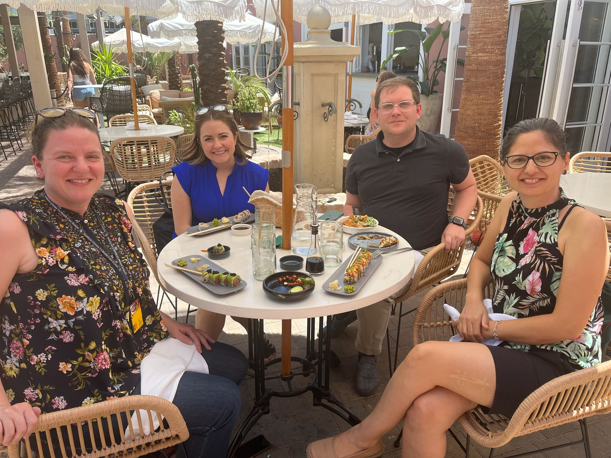

---
# Leave the homepage title empty to use the site title
title: ''
summary: 'Official portal of SOHE LAB – Social and Health Psychology Laboratory at Hacettepe University.'
date: 2026-01-01
type: landing

sections:
  # 1. BÖLÜM: SOHE LAB Giriş, İki Fotoğraf ve İki Kolonlu Metin Düzeni
  - block: markdown
    id: sohelab
    content:
      title: '🔬 SOHE LAB / Social & Health Psychology Lab'
      subtitle: 'Social & Health Psychology Laboratory — Hacettepe University'
      text: |-
         

        <table style="width:100%; border:none; border-collapse:collapse; margin-top:20px;">
          <tr>
            <td style="width:50%; padding-right:25px; vertical-align:top; border:none; line-height:1.6;">
              Welcome to the official portal of <strong>SOHE LAB</strong>. Directed by Assoc. Prof. Dr. Melike Eğer Aydoğmuş at Hacettepe University, our laboratory investigates the psychological mechanisms underlying human behavior, social attitudes, and well-being.
                
              Our primary research lines focus on the dynamics of <strong>stigma, perfectionism, self-compassion, self-determination theory (psychological needs and motivation), and emotion processing</strong>. Utilizing advanced quantitative analyses, structural equation modeling (SEM), and mixed-methods research designs, SOHE LAB aims to bridge universal psychological constructs with profound cultural dynamics. We strive to generate scientific evidence that informs public health, shapes educational interventions, and guides policy-making for vulnerable groups.
            </td>
            <td style="width:50%; padding-left:25px; vertical-align:top; border-left:1px solid #e3e3e3; border-top:none; border-right:none; border-bottom:none; line-height:1.6;">
              <strong>SOHE LAB Araştırma Dünyasına Hoş Geldiniz.</strong> Hacettepe Üniversitesi bünyesinde Doç. Dr. Melike Eğer Aydoğmuş direktörlüğünde faaliyet gösteren laboratuvarımızda; insan davranışının, sosyal tutumların ve psikolojik iyi oluşun arkasındaki mekanizmaları inceliyoruz.
                
              Temel araştırma alanlarımız arasında <strong>damgalama (stigma), mükemmeliyetçilik, öz-şefkat, öz-belirleme kuramı (psikolojik ihtiyaçlar ve motivasyon) ve duygu işleme süreçleri</strong> yer almaktadır. İleri nicel analizler, yapısal eşitlik modellemesi (SEM) ve karma yöntemli desenler kullanan SOHE LAB, evrensel psikoloji yaklaşımlarını kültürel dinamiklerle harmanlamayı ve toplumsal refaha katkı sunacak bilimsel çıktılar üretmeyi amaçlar.
            </td>
          </tr>
        </table>
    design:
      columns: '1'

  # 2. BÖLÜM: Current Team / Aktif Ekibimiz
  - block: markdown
    id: team
    content:
      title: '👥 Current Team / Aktif Ekibimiz'
      subtitle: 'The minds driving the research at SOHE LAB'
      text: |-
        #### **Director / Laboratuvar Direktörü**
        * **Assoc. Prof. Dr. Melike Eğer Aydoğmuş** (Hacettepe University)

        #### **Lab Coordinator / Laboravuvar Koordinatörü**
        * **Damla Gültekin Gökçeli, M.A.** - Email: [damlagultekin@hacettepe.edu.tr](mailto:damlagultekin@hacettepe.edu.tr)

        #### **Graduate Student Researchers / Lisansüstü Öğrenci Araştırmacılar**
        * **Cihangir Arkaç** * **Kübra Ceren Babaoğlu**

        #### **Undergraduate Student Researchers / Lisans Öğrenci Araştırmacılar**
        * **Şebnem Ünal** * **Abdulkerim Altuğ Koç** * **Kıymet Ayşegül Kardeş** * **Zeynep Sude Gürlesin** * **Zehra Nur Ayaz** * **Tuğçe Topçuoğlu** * **Tuana Yücel** * **Asya Çetin** * **Bilge Durak** * **Zeynep Yüksel** * **Beyza Ekin Nigar**
    design:
      columns: '1'

  # 3. BÖLÜM: Director / Direktör Profil Alanı
  - block: resume-biography-3
    id: about
    content:
      username: me
      text: ''
      headings:
        about: ''
        education: ''
        interests: ''
    design:
      background:
        gradient_mesh:
          enable: true
      name:
        size: md
      avatar:
        size: medium
        shape: circle

  # 4. BÖLÜM: Publications / Öne Çıkan Yayınlar
  - block: collection
    id: papers
    content:
      title: Featured Publications / Öne Çıkan Yayınlar
      count: 0
      filters:
        folders:
          - publications
        featured_only: false
    design:
      view: article-grid
      columns: '2'

  # 5. BÖLÜM: Projects & Collaborations / Projeler ve Ortaklıklar
  - block: collection
    id: projects
    content:
      title: '🔬 Projects & Collaborations / Projeler ve Ortaklıklar'
      subtitle: 'International, national, and cross-cultural research pipelines at SOHE LAB'
      text: |-
        At <strong>SOHE LAB</strong>, we lead and collaborate on high-impact national and international cross-cultural projects. Our active research pipelines investigate the complexities of stigma, ageism, humor, and psychological well-being across diverse cultural contexts.
          
        <strong>SOHE LAB</strong> bünyesinde, yüksek akademik etkiye sahip ulusal ve kültürlerarası uluslararası projeler yürütmekte ve ortaklıklar kurmaktayız. Aktif araştırma hatlarımız; damgalama, yaş ayrımcılığı, mizah ve psikolojik iyi oluş gibi temaları farklı kültürel bağlamlarda incelemektedir.

        

        ### 🌍 International Collaborations / Uluslararası Ortaklıklar

        * <strong>A Cross-Cultural Examination of Dementia Stigma Among Young Adults</strong> 
          • <em>International Collaborator:</em> Assoc. Prof. Dr. Molly Maxfield (Edson College of Nursing and Health Innovation, Arizona State University, USA)

        * <strong>A Longitudinal Cross-Cultural Study on the Consequences of Ageism</strong> 
          • <em>International Collaborators:</em> Asst. Prof. Dr. Aaron Guest & Asst. Prof. Dr. Hannah Giasson (Edson College of Nursing and Health Innovation, Arizona State University, USA)

        * <strong>Humor, Self-Compassion, and Psychological Well-Being: A Cross-Cultural Approach</strong> 
          • <em>International Collaborators:</em> Prof. Dr. Andrea Samson & Dr. Ana Milosavljevic (Faculty of Psychology, UniDistance Suisse / FernUni Schweiz, Brig, Switzerland)

        

        

          
        

        

          To explore our active grants, other ongoing and completed research pipelines, please visit our dedicated projects portal.
           
          <em>Aktif fonlarımızı, devam eden ve tamamlanan araştırma projelerimizi incelemek için lütfen projeler portalımızı ziyaret edin.</em>
        

        <a href="projects/" style="background-color: #007bff; color: white; padding: 10px 20px; text-decoration: none; border-radius: 5px; font-weight: bold; display: inline-block; margin-top: 5px;">Explore Projects / Projeleri İncele ➡️</a>
      filters:
        folders:
          - 'non-existent-folder'
    design:
      columns: '1'
      view: card

  # 6. BÖLÜM: SOHE Life / Labdan Kareler
  - block: collection
    id: news
    content:
      title: SOHE Life / Labdan Kareler
      subtitle: ''
      text: ''
      page_type: blog
      count: 10
      filters:
        author: ''
        category: ''
        tag: ''
        exclude_featured: false
        exclude_future: false
        exclude_past: false
        publication_type: ''
      offset: 0
      order: desc
    design:
      view: card

  # 7. BÖLÜM: Talks / Etkinlikler ve Konuşmalar
  - block: collection
    id: talks
    content:
      title: Talks & Events / Etkinlikler ve Konuşmalar
      filters:
        folders:
          - events
    design:
      view: card

  # 8. BÖLÜM: Join Us / Bize Katılın
  - block: markdown
    id: join
    content:
      title: '🚀 Join Us / Bize Katılın'
      subtitle: ''
      text: |-

        ### 🇬🇧 Join Us

        **SOHE LAB** is always delighted to welcome passionate and highly motivated undergraduate and graduate students into our research pipeline. Being a part of our team offers firsthand field and kitchen experience in literature reviews, experimental designs, advanced quantitative methodologies, data collection, and manuscript preparation.

        Researchers who are eager to specialize in social and health psychology domains — such as stigma, psychological needs, personality, motivation, cross-cultural differences, perfectionism, self-compassion, and emotion processes — and who hold an interest in mixed methods are welcome to join us as volunteer lab members.

        - 📧 **To volunteer:** Email our Lab Coordinator Damla Gültekin Gökçeli → damlagultekin@hacettepe.edu.tr
        - 📧 **For Master's or PhD supervision:** Email the Director → melike.aydogmus@hacettepe.edu.tr

        ---

        ### 🇹🇷 Bize Katılın

        **SOHE LAB** bünyesinde, araştırma mutfağımıza dahil olacak tutkulu ve motivasyonu yüksek lisans ve lisansüstü öğrencileriyle çalışmaktan her zaman mutluluk duyuyoruz. Ekibimizde yer almak; literatür taraması, deneysel desenler, ileri nicel yöntemler, veri toplama ve makale hazırlama süreçlerinde doğrudan deneyim kazanma fırsatı sunar.

        Sosyal ve sağlık psikolojisi temalarında — damgalama, psikolojik ihtiyaçlar, kişilik, motivasyon, kültürler arası farklılıklar, mükemmeliyetçilik, öz-şefkat, duygu süreçleri — uzmanlaşmak isteyen ve karma yöntemlere ilgi duyan araştırmacılar gönüllü üye olarak bize katılabilir.

        - 📧 **Gönüllü üyelik için:** Lab Koordinatörümüz Damla Gültekin Gökçeli → damlagultekin@hacettepe.edu.tr
        - 📧 **Yüksek lisans / doktora danışmanlığı için:** Direktör → melike.aydogmus@hacettepe.edu.tr

    design:
      columns: '1'
---
